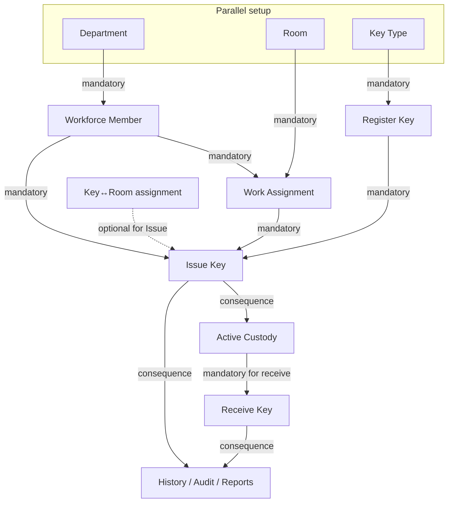

# KeyInventory Operator Guide

Concise guide for day-to-day key custody at a single-site KeyInventory installation.  
Screenshots are from the final OPERATOR-EXPERIENCE-1 runtime.

## What KeyInventory does

KeyInventory helps a key custodian:

- catalog physical keys and the rooms they open
- issue and receive keys to workforce members
- see who currently holds each key
- correct authorized business records
- review audit history and reports

There is no Organization or Building setup. Departments and Rooms belong directly to this installation.

## Dependency model (authoritative)

The application readiness panel, this guide, and the diagram below use the same model.

| Relationship | Meaning |
|---|---|
| **Mandatory** | Must exist before the next step can succeed |
| **Parallel** | Can be created independently / in any order |
| **Optional** | Helpful, not required for Issue Key |
| **Consequence** | Created by a successful operation |
| **Lifecycle** | Activate / retire / end / terminate — not first create |

### Minimum first-use path

1. Sign in.
2. Create **Department**, **Room**, and **Key Type** in any order.
3. Create the first **Workforce Member** (no second person required).
4. Create a **Work Assignment** (member ↔ room) — required before Issue.
5. **Register** a Key.
6. Optionally assign **Key↔Room**.
7. **Issue Key** → **Active Loans** → **Receive** when returned.

After setup is complete, Home focuses on daily custody and recent activity:

## First-time setup

### Purpose
Reach a state where Issue Key is possible without guessing prerequisites.

### Prerequisites
Signed-in operator account.

### Where to go
**Home** shows Setup readiness and First-time setup cards.  
**Administration** holds Departments, Rooms, Workforce Members, Work Assignments, Audit Trail.  
**Catalog** holds Key Types, Register Key, Key↔Room.

### Steps
1. Open Home and read Setup readiness.
2. Create missing items using the Create links.
3. When readiness reports Issue Key is available, open **Operations → Issue Key**.

### Expected result
Counts move above zero; Next action advances; Issue Key becomes usable.

### Common problems
- Issue blocked with no Work Assignment — create member-to-room assignment.
- Cannot create Workforce Member — create Department first.

### What becomes available next
Workforce Members → Work Assignments → Register Key → Issue.

---

## Creating Departments

### Purpose
Name organizational units used for membership and department-based issue justification.

### Prerequisites
None (parallel).

### Where to go
Administration → Departments → **+ Add department**

### Steps
1. Enter a unique Department code (example: `FACILITIES`).
2. Create Department.
3. Confirm it appears on the Departments list (form returns clean for another add via redirect).

### Expected result
Active department listed.

### Common problems
Duplicate department code is rejected.

### What becomes available next
Workforce Member creation can use that department.

---

## Creating Rooms

### Purpose
Define places for work assignments and rooms opened by keys.

### Prerequisites
None (parallel). Room numbers are unique across the whole installation.

### Where to go
Administration → Rooms → **+ Add room**

### Steps
1. Enter Room number (operator identity) and optional description.
2. Create Room (system assigns internal room identity automatically).
3. Edit Room number/description later from Rooms → Edit when correction is needed.

### Expected result
Room appears with its room number.

### Common problems
Duplicate room number is rejected globally.

### What becomes available next
Work Assignments and Key↔Room.

---

## Creating Workforce Members

### Purpose
Register a person as an active worker who may receive keys.

### Prerequisites
**Mandatory:** active Department.  
No second workforce member and no manager are required.

### Where to go
Administration → Workforce Members → **+ Add workforce member**

### Steps
1. Enter First name, Last name, UIN (9 digits), Type, Department.
2. Create.
3. Open Details to correct name, UIN, department, or type when needed.

### Expected result
One Active member with name, UIN, type, department.

### Common problems
- Missing department.
- UIN already used by another person.

### What becomes available next
Work Assignment for that member.

---

## Creating Work Assignments

### Purpose
Link a workforce member to a room where they are authorized to work.  
**Mandatory before Issue Key.**

### Prerequisites
Active Workforce Member and active Room.

### Where to go
Administration → Work Assignments → **+ Add**

### Steps
1. Select member and room.
2. Mark primary when appropriate (at most one active primary per member).
3. Create.

### Expected result
Active assignment listed.

### Common problems
Creating assignment before room or member exists.

### What becomes available next
Issue Key eligibility (together with a registered key).

---

## Key Types and registering Keys

### Purpose
Classify and catalog physical keys.

### Prerequisites
Key Type may be created when registering a key if it does not exist (Catalog Register), or managed under Catalog → Key Types.

### Where to go
Catalog → Register Key / Key Types

### Steps
1. Ensure a Key Type exists (or enter a new type code on Register).
2. Enter Catalog key code and type.
3. Register.

### Expected result
Key appears in catalog and Find Key.

### What becomes available next
Key↔Room and Issue Key.

---

## Assigning rooms opened by a Key

### Purpose
Record which rooms a physical key opens.

### Prerequisites
Registered Key and active Room.  
**Optional for Issue Key**; recommended for Find Key / rooms-opened clarity.

### Where to go
Catalog → Key Rooms (or key-specific Key↔Room surface)

### Steps
1. Select key and room.
2. Assign.
3. Remove only when the opening association should end.

---

## Issuing a Key

### Purpose
Hand a cataloged key to an eligible workforce member.

### Prerequisites (mandatory)
- Active Workforce Member with valid Party identity
- Active Department on that member
- At least one active Work Assignment
- Registered Key
- Justification: member’s Department **or** an assigned Work Assignment Room

### Where to go
Operations → Issue Key

### Steps
1. Select Key and Issue to person.
2. Choose For = Department or Room and the matching justification.
3. Confirm Issued / Due (local date-time controls).
4. Enter Loan code.
5. Issue Key.

### Expected result
Success message; Active Loans shows the open loan with human-readable times.

### Common problems
- Readiness still shows missing Work Assignment or Key.
- Justification room not on the member’s assignments.

### What becomes available next
Active Custody / Receive.

---

## Active custody and Receive

### Purpose
See who holds keys; complete return.

### Prerequisites
Open loan for Receive.

### Where to go
Operations → Active Loans → Receive, or Operations → Receive Key

### Steps
1. Open the active loan.
2. Confirm received time with the local control.
3. Complete receive.

### Expected result
Loan leaves Active; appears in History as returned.

---

## Find Key

### Purpose
Locate a key quickly and see rooms it opens / custody context.

### Where to go
Home search or Operations Find Key surfaces.

### Prerequisites
Catalog data (assignments enrich the result when present).

---

## Correcting authorized records

Operators may correct:

| Record | What you can correct |
|---|---|
| Room | Room number, description; activate/retire |
| Department | activate/retire (code is fixed) |
| Workforce Member | Department, type; terminate |
| Party | First/Last name; **UIN** via governed correction on the same person |
| Work Assignment | End; primary flag |
| Key Type | activate/retire |
| Key↔Room | assign/remove |

UIN correction keeps the same person and history; it rejects UIN already used by someone else and writes a new Audit Trail row with old and new UIN.

---

## Audit Trail

### Purpose
See who performed which business action.

### Where to go
Administration → Audit Trail

### Steps
Filter by date, operator, action, or subject; export CSV / Excel / PDF of the same result.

### Notes
Historical rows that mention older Organization/Building/manager language remain readable. New work does not require those concepts.

---

## Reports and exports

### Where to go
Reports menu (existing REPORTS-1 reports).

### Steps
Filter on screen, then download CSV, Excel, or PDF.  
Timestamps appear in readable `yyyy-MM-dd HH:mm UTC` form in exports; on-screen lists use friendly local/relative presentation.

---

## Common blockers

| Symptom | Likely cause | What to do |
|---|---|---|
| Cannot Issue | Missing Work Assignment or Key | Complete readiness checklist |
| Cannot add Workforce Member | No Department | Create Department |
| Cannot add Work Assignment | Missing member or room | Create both first |
| Duplicate Room number | Global uniqueness | Choose a different number |
| UIN correction fails | UIN already used | Use a free UIN |
| Looking for Organization/Building | Removed from product | Use Departments and Rooms only |

---

## Daily cycle summary

