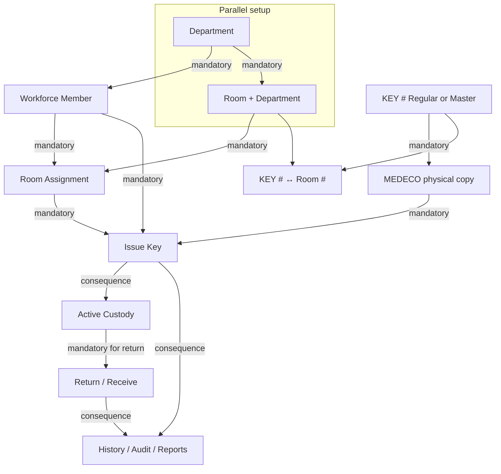
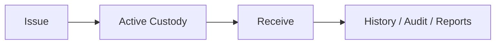

# KeyInventory Operator Guide

Concise guide for day-to-day key custody at a single-site KeyInventory installation.

In-application **Help** (`/Help`) is the operator-invoked visual reference for the same operational story: organization of records, KEY # / MEDECO, Issue → Active custody → Receive, Find (including Room # reverse-search), lifecycle, Audit Trail, and Reports. This markdown guide remains the portable documentation form; it does not duplicate Help HTML.

## What KeyInventory does

KeyInventory helps a key custodian:

- maintain **KEY #** access patterns and the **Room #** values each KEY # opens
- create **MEDECO** keys under a KEY #
- issue and return exact physical copies to people
- see who currently holds each physical copy
- correct authorized business records
- review audit history and reports

There is no Organization or Building setup. Departments and Rooms belong directly to this installation.

## KEY # and MEDECO (authoritative vocabulary)

| Term | Meaning |
|---|---|
| **KEY #** | Shared access number. Associated with the set of Rooms that open. Many physical copies may share one KEY #. Owns Regular or Master classification. |
| **Classification** | Regular or Master on the KEY #. Explicit choice — not inferred from how many Rooms the KEY # opens. |
| **MEDECO** | Identifies the specific key issued to a person. Unique within a KEY #; may repeat under a different KEY #. |
| **Room #** | Operator-facing room identifier. Every Room belongs to exactly one Department. |

**Example**

- KEY # `66800`
- Rooms opened: `410D`
- Physical copies:
  - MEDECO `26`
  - MEDECO `27`
  - MEDECO `28`

Rooms opened are recorded once on the KEY #. Every MEDECO copy under that KEY # opens the same Rooms. Issue and return always name the exact MEDECO copy (for example KEY # 66800 / MEDECO 26), not merely the KEY #.

## Dependency model (authoritative)

This guide and the Application readiness/eligibility model use the same dependency classifications. Initial configuration is documented here; Home is an operational dashboard and does not permanently host setup UI.

| Relationship | Meaning |
|---|---|
| **Mandatory** | Must exist before the next step can succeed |
| **Parallel** | Can be created independently / in any order |
| **Optional** | Helpful, not required for Issue Key |
| **Consequence** | Created by a successful operation |
| **Lifecycle** | Edit where mutable; Delete only when unused/unreferenced; otherwise Activate / Retire / End / Terminate / Remove |

### Minimum first-use path

1. Sign in.
2. Create **Department**, then **Room #** (Room requires a Department).
3. Create the first **Workforce Member** (no second person required).
4. Create a **Room Assignment** (member ↔ room in the same Department) — required before Issue.
5. **Create Key** with **KEY #** + **MEDECO** on the same screen (Classification and Rooms when the KEY # is new).
6. **Issue Key** (available key first, then person; Rooms derived) → **Active custody** → **Return** the same MEDECO when returned.

Home remains an operational dashboard (metrics, Daily custody, Recent Activity) during and after initial configuration:

## Initial configuration (documentation sequence)

### Purpose
Reach a state where Issue Key is possible without guessing prerequisites. This sequence belongs in documentation; it is not a permanent Home or Administration setup surface.

### Prerequisites
Signed-in operator account.

### Where to go
**Administration** — Departments, Rooms, Workforce Members, Room Assignments, Audit Trail.  
**Catalog** — Create Key, KEY # ↔ Room (no Key Types page).  
**Operations → Issue Key** — when prerequisites are missing, Issue Key explains the missing Application-owned prerequisites and links to resolve them.

### Steps
1. Create **Department**, then **Room** (Room requires Department) under Administration.
2. Create the first **Workforce Member**, then a **Room Assignment** (room must be in the member’s Department).
3. Create a **KEY #** (Regular or Master) / **MEDECO** in Catalog → Create Key (assign Room openings on the KEY # as needed).
4. Open **Operations → Issue Key**. If anything mandatory is still missing, resolve the items listed there, then issue.

### Expected result
Issue Key becomes usable; Home stays focused on custody metrics and activity (no leftover onboarding checklist).

### Common problems
- Issue blocked with no Room Assignment — create member-to-room assignment.
- Cannot create Workforce Member — create Department first.

### What becomes available next
Workforce Members → Room Assignments → Create Key → Issue.

---

## Creating Departments

### Purpose
Name organizational units used for membership and department-based issue justification. **Department** is the operator-facing business identifier; under active identity authority it is editable without destroying the department’s relationships or history (stable internal DepartmentId is not an operator typing target; internal `DepartmentCode` authority is unchanged).

### Prerequisites
None (parallel).

### Where to go
Administration → Departments → **+ Add department**

### Steps
1. Enter a unique Department (example: `FACILITIES`).
2. Create Department.
3. Confirm it appears on the Departments list (form returns clean for another add via redirect).

### Expected result
Active department listed.

### Common problems
Duplicate Department is rejected.

### What becomes available next
Workforce Member creation and Room creation can use that department.

---

## Creating Rooms

### Purpose
Define places for room assignments and rooms opened by keys. Every Room belongs to exactly one Department.

### Prerequisites
**Mandatory:** active Department.

### Where to go
Administration → Rooms → **+ Add room**

### Steps
1. Select Department.
2. Enter Room number (operator identity) and optional description.
3. Create Room (system assigns internal room identity automatically).
4. Edit Room number/description/Department later from Rooms → Edit when correction is needed.

### Expected result
Room appears with its room number and Department.

### Common problems
- Missing Department.
- Duplicate room number is rejected globally.

### What becomes available next
Room Assignments (same Department as the member) and Key↔Room.

---

## Creating Workforce Members

### Purpose
Register a person as an active worker who may receive keys.

### Prerequisites
**Mandatory:** active Department.  
No second workforce member and no manager are required.

### Where to go
Administration → Workforce Members → **+ Add workforce member**

### Steps
1. Enter First name, Last name, UIN (9 digits), Type, Department.
2. Create.
3. Open Details to correct name, UIN, department, or type when needed.

### Expected result
One Active member with name, UIN, type, department.

### Common problems
- Missing department.
- UIN already used by another person.

### What becomes available next
Room Assignment for that member.

---

## Assigning Rooms (Room Assignments)

### Purpose
Assign a workforce member to a room where they are authorized to work.  
**Mandatory before Issue Key.** Room Department must match the member’s Department.

### Prerequisites
Active Workforce Member and active Room in the same Department.

### Where to go
Administration → Room Assignments → **Assign Room**

### Steps
1. Search/select the workforce member (name or UIN). Confirm Name, UIN, and Department shown after selection.
2. Search/select a Room in that member’s Department.
3. **Assign Room**.

### Expected result
Active assignment listed for the member and Room (no assignment code; no primary flag). Next Assign Room opens clean.

### Common problems
- Creating assignment before room or member exists.
- Room and member in different Departments — rejected.

### What becomes available next
Issue Key eligibility (together with a created key).

---

## KEY #, Classification, and MEDECO copies

### Purpose
Record which Room # values a KEY # opens, set Regular or Master classification on the KEY #, and create keys. There is no Key Types page.

### Prerequisites
None for creating a KEY # beyond operator access. Classification is Regular or Master on the KEY # itself.

### Where to go
Catalog → Create Key; Catalog → Keys → KEY # Rooms

### Steps — New Key
1. Choose **New Key**.
2. Type or search a **KEY #** (existing or new; Application resolves which).
3. If the KEY # already exists, confirm derived **Classification** and **Rooms** (read-only).
4. If the KEY # does not exist, select **Regular** or **Master** and existing **Rooms** on the same form (nothing auto-selected; Master is not inferred from Room count).
5. Enter the **MEDECO**.
6. **Create Key** — KEY # and MEDECO are always required; next New Key opens clean.

### Steps — Replace Lost Key
1. Choose **Replace Lost Key**.
2. Search and select a **Lost** key (KEY # / MEDECO; Available/Issued/Destroyed excluded).
3. Confirm derived KEY #, Classification, and Rooms.
4. Enter a **New MEDECO** (reuse not allowed).
5. **Replace Key** — source remains Lost; new key starts Active/Available under the same KEY #.

### Expected result
KEY # shows Classification and Rooms; keys appear under that KEY # in catalog and Find Key. Physical condition and custody are shown separately. Available/Issued follows Active + open Loan.

### What becomes available next
Issue Key for an Available key.

---

## KEY # access (Regular / Master)

### Purpose
Classification defines which Rooms a KEY # opens. Every MEDECO copy under that KEY # shares the same access.

### Prerequisites
For a new Regular KEY #: an active Room.  
Master KEY #: no Room selection — Access is All Rooms.  
Room assignment on Work Assignments (member↔room) is a different concept.

### Where to go
Catalog → **Create Key** (`/Catalog/Register`)

### Steps
1. Enter KEY # and MEDECO.
2. If the KEY # is new: choose Regular or Master. Regular requires exactly one Room; Master requires none.
3. If the KEY # already exists: Classification and Access are shown read-only; only MEDECO is added.
4. There is no KEY # Rooms assign/remove screen.

---

## Issuing a Key

### Purpose
Hand an available MEDECO physical copy to an eligible person.

### Prerequisites (mandatory)
- Active Workforce Member with valid Party identity
- Active Department on that member
- At least one active Room Assignment
- Available MEDECO physical copy under a KEY #
- Justification: member’s Department **or** an assigned Room Assignment Room

### Where to go
Operations → Issue Key

### Steps
1. Search/select the **physical key** first (KEY # / MEDECO searchable combobox for issuable copies; nothing is preselected).
2. Confirm derived **Classification** and **Rooms opened** (do not re-enter Rooms).
3. Search/select **Key holder** by name or UIN (eligible matches only; searchable combobox).
4. Choose For = Department or Room and the matching justification (no default).
5. Confirm Issued / Due as operator local times (human-readable entry).
6. Enter Loan code.
7. Issue Key — next Issue opens clean.

### Expected result
Success message; Active custody shows KEY # + MEDECO for the open issue with human-readable times.

### Common problems
- Readiness still shows missing Room Assignment or Key / MEDECO copy.
- Selected MEDECO already issued.
- Justification room not on the member’s assignments.

### What becomes available next
Active Custody / Return of that exact MEDECO copy.

---

## Active custody and Return

### Purpose
See who holds which MEDECO copy; complete return of that exact copy.

### Prerequisites
Open loan for the physical copy being returned.

### Where to go
Operations → Active Loans → Receive/Return, or Operations → Receive Key

### Steps
1. Search open custody with the searchable combobox by **KEY #**, **MEDECO**, holder name, or UIN (bounded matches; nothing is preselected). Deep-link from Active Loans may open one deliberate issue.
2. Select the matching open issue labeled **KEY # / MEDECO · holder — UIN** (for example KEY # 66800 / MEDECO 26 · …).
3. Enter Receive reference and Received (operator local time).
4. Complete return — next Receive opens clean.

### Expected result
That MEDECO copy leaves Active custody; appears in History as returned. Other MEDECO copies under the same KEY # are unaffected.

---

## Header search (global operational search)

### Purpose
Answer practical questions about a person, Room, KEY #, or MEDECO copy by composing current operational facts from existing authorities.

### Where to go
Header search → Search Results (`/Search`). The header owns the Search box; the results page does not show a second Search form.

### How to search
One header box accepts **name**, **UIN**, **Room #**, **KEY #**, or **MEDECO**. No search-type dropdown. Results are typed groups (People, Rooms, KEY #, MEDECO) — only groups with matches appear.

### Person results
Show Full Name, UIN, Department, status, active **Room Assignment** Room # values, and **Current Key Custody** (open custody only). For each current physical copy: KEY #, MEDECO, Rooms opened by that KEY #, Issued time. A person with no current keys is still a valid result (`No keys currently issued.`). Room Assignment is not key custody. History is not listed here. There are no Member details / Member keys buttons on search results.

### Room / KEY # / MEDECO results
- Room #: description when available; KEY # values that open it.
- KEY #: Classification; Rooms opened; MEDECO copies with Available/Issued and holder when issued.
- MEDECO: always with parent KEY # (not globally unique); Rooms via KEY #; custody/holder.

### Zero results
`No results found for "…"` plus guidance to search by name, UIN, Room #, KEY #, or MEDECO.

---

## Find Key

### Purpose
Key-specific search for KEY # / MEDECO / Classification / Room # questions.

### Where to go
Operations → Find Key (`/Operations/Find`).  
(Header search is global operational search — not Find Key.)

### Prerequisites
Catalog data (KEY # Room openings and MEDECO copies).

### How to search
One search box accepts **KEY #**, **MEDECO**, **Classification** (Regular/Master), or **Room #** (operator-facing room number). Matching is the same partial-match style used for KEY # / MEDECO / classification. Searching a Room # returns every KEY # that opens that room, with each MEDECO copy’s availability and current holder. Master classification is not the same as “opens multiple rooms.”

### What you should be able to answer
- What Room # values does KEY # 66800 open?
- What MEDECO copies exist under KEY # 66800? Which are available or issued?
- Who holds MEDECO 28 under KEY # 66800?
- Which KEY # values open Room X? (search Find by that Room #)
- Which KEY # / MEDECO a person currently holds? (prefer header person search, Member Keys, or Keys by Member report)

---

## Correcting authorized records

Operators may correct:

| Record | What you can correct |
|---|---|
| Room | Room number, description, Department; activate/retire; **Delete** only when unused |
| Department | **Edit** Department (same department kept); activate/retire; **Delete** only when unused |
| Workforce Member | Department, type; terminate; **Delete** only when unused (no assignments/loans) |
| Party | First/Last name; **UIN** via governed correction on the same person |
| Room Assignment | End; **Delete** only for active unused assignments |
| KEY # | Classification (Regular/Master); activate/retire; **Delete** only with no MEDECO copies and no Room assignments |
| MEDECO copy | activate/retire; **Delete** only with no loan history |
| Key↔Room | assign/remove |

### Delete vs Retire
- **Delete** permanently removes an unused record that has no business relationships and no history that must be preserved. Confirm deliberately; deletion cannot be undone.
- **Retire** (or End / Terminate for relationship/person records) keeps the record so history and references remain meaningful.
- If Delete is unavailable, the record is in use — Retire/End/Terminate instead.
- Deleted records do not exist; retired records still exist and may be Activated when that lifecycle is supported.

UIN correction keeps the same person and history; it rejects UIN already used by someone else and writes a new Audit Trail row with old and new UIN.

---

## Audit Trail

### Purpose
See who performed which business action.

### Where to go
Administration → Audit Trail

### Steps
Filter by date, operator, action, or subject; export CSV / Excel / PDF of the same result.

### Notes
Historical rows that mention older Organization/Building/manager language remain readable. New work does not require those concepts.

---

## Reports and exports

### Where to go
Reports menu (existing REPORTS-1 reports).

### Steps
Filter on screen, then download CSV, Excel, or PDF.  
Timestamps appear in readable `yyyy-MM-dd HH:mm UTC` form in exports; on-screen lists use friendly local/relative presentation.

---

## Common blockers

| Symptom | Likely cause | What to do |
|---|---|---|
| Cannot find person at Issue | Inactive member, missing Room Assignment, or search terms | Verify active Workforce Member + Room Assignment; search by name or UIN |
| No MEDECO available | None created, or all issued/unavailable | Create a key or return an open issue |
| Cannot Issue | Missing governed prerequisites | Use the contextual resolution links on Issue Key |
| Cannot delete Department | Relationships or history block Delete | Retire when Delete is unavailable |
| Cannot return | No matching open loan / wrong copy | Select the open KEY # / MEDECO issue on Receive |
| KEY # missing expected Room | Room not assigned to that KEY # | Assign under Catalog → KEY # Rooms |
| Duplicate Room number | Global uniqueness | Choose a different number |
| UIN correction fails | UIN already used | Use a free UIN |

---

## Daily cycle summary

